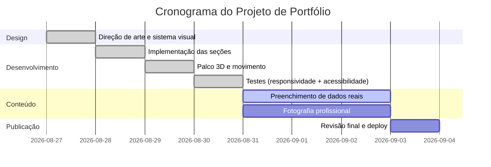

# Maria Eduarda — Portfólio (Contadora)

Site one-page em **Next.js (App Router) + TypeScript + Tailwind CSS v4 + GSAP + Three.js**.

Portfólio pessoal — não é site de vendas. Sem preços, planos, pacotes ou
elementos de SaaS.

---

## 1. Direção de arte

Editorial minimalista premium, seguindo `<design_direction>` do briefing.

### Paleta — preto e branco puros

| Token | Hex | Uso |
|---|---|---|
| `--ink` | `#000000` | fundo dos palcos escuros, texto sobre claro |
| `--paper` | `#ffffff` | fundo padrão, texto sobre escuro |
| `--mist` | `#f7f7f7` | áreas neutras claras |
| `--graphite` | `#333333` | texto secundário sobre claro |
| `--slate` | `#6e6e73` | legendas sobre claro (4,9:1) |
| `--fog` | `#86868b` | legendas sobre escuro (5,7:1) |

Contraste de 21:1 entre `#000` e `#fff`. Sem cor corporativa, sem gradiente
chamativo. Os dois cinzas de legenda foram escolhidos por medida de contraste,
não por aparência: cada um só é usado no fundo onde passa em AA.

### Tipografia

Uma família só (**Inter**, pesos 400/500/600), com escala e tracking calibrados
para leitura de página de produto: corpo em 17px e tracking negativo crescente
conforme o tamanho sobe.

| Classe | Peso | Tracking |
|---|---|---|
| `.t-display` | 600 | −0.035em |
| `.t-title` | 600 | −0.028em |
| `.t-headline` | 600 | −0.022em |
| `.t-intro` / `.t-body` | 400 | −0.012em / −0.01em |

> **Nota sobre a fonte.** A tipografia da Apple (SF Pro) é proprietária e não
> pode ser distribuída num site de terceiros. Inter é a equivalente aberta mais
> próxima — mesma linhagem neogrotesca, altura-x alta. O que aproxima a leitura
> do padrão premium não é o arquivo da fonte, e sim o tracking negativo, o peso
> 600 nos títulos e a escala de corpo em 17px.
>
> O briefing sugeria misturar serifa nos títulos com sans no corpo
> (`<design_direction>`); a estética pedida depois é integralmente sans. Mantive
> sans em tudo por causa dessa segunda instrução — se preferir a serifada nos
> títulos, é trocar `.t-display` e `.t-title` em `globals.css`.

### Movimento

O briefing pede animações **muito sutis**. Só há dois recursos: fade com
deslocamento de 14px na entrada das seções, e rotação lenta do objeto 3D.
Nenhuma curva de overshoot, mola ou bounce.

### Estrutura das seções

A gramática é de página de produto — palco escuro sangrando, tipografia de
display, sub-nav fixa, galeria horizontal com encaixe —, aplicada a conteúdo de
portfólio. Nenhum layout, texto ou componente foi copiado das referências.

---

## 2. O objeto 3D

`src/components/Stage3D.tsx` — sete lâminas finas de cantos arredondados
empilhadas em hélice, metal escovado, luz de contorno forte sobre preto.

A escolha é deliberada: lê-se como camadas, ordem e precisão, sem recorrer aos
clichês que o briefing proíbe (calculadora, pilha de moedas, ícones de agência).

Decisões de performance, porque o briefing exige LCP < 2s e Lighthouse ≥ 90:

- `three` puro, sem react-three-fiber/drei — bundle bem menor;
- carregado por `import()` dinâmico **depois** da montagem, nunca no caminho
  crítico: o texto pinta primeiro;
- checagem de WebGL antes de carregar; sem suporte, nada é baixado;
- `devicePixelRatio` limitado a 2;
- laço de render pausado quando o canvas sai da viewport;
- ambiente procedural (`RoomEnvironment`), sem baixar HDR;
- com `prefers-reduced-motion`, desenha um único quadro e não abre laço;
- `dispose()` de geometria, material, textura e renderer no unmount.

O objeto ocupa uma faixa própria **abaixo** do texto, nunca atrás dele — o
contraste do display fica garantido pela estrutura, e não por ajuste de
iluminação que quebraria em outra tela.

---

## 3. Estrutura

```
src/
├── app/
│   ├── layout.tsx          # Inter, metadata pt-BR
│   ├── page.tsx            # composição da página
│   └── globals.css         # tokens + escala tipográfica
├── components/
│   ├── SubNav.tsx          # barra fixa que surge após o palco
│   ├── Hero.tsx            # palco de abertura + objeto 3D
│   ├── Stage3D.tsx         # cena Three.js (carregada sob demanda)
│   ├── Overture.tsx        # uma frase, sozinha na tela
│   ├── Chapters.tsx        # capítulos alternados + faixa do retrato
│   ├── Highlights.tsx      # especialidades em galeria horizontal
│   ├── Differentiators.tsx # faixa de diferenciais
│   ├── Trajectory.tsx      # formação e experiência
│   ├── Contact.tsx         # contato + formulário
│   └── Footer.tsx
├── content/site.ts         # TODO o conteúdo editável
└── lib/gsap.ts             # eases contidos, useGsap, useReducedMotion
```

`public/fallback.html` é a versão estática (sem JS) das seções Abertura e
Contato, na mesma paleta.

---

## 4. Dados pendentes

Nada foi inventado. Preencher em **`src/content/site.ts`**:

- [ ] `hero.statement` — a frase curta de impacto.
- [ ] `hero.intro` — a linha de apoio.
- [ ] `overture.statement` — a frase de abertura da narrativa.
- [ ] `chapters[]` — os textos de *O que*, *Por que* e *Como*.
- [ ] `highlights[]` — as quatro áreas de atuação.
- [ ] `differentiators[]` — **só o que for real**. Se não houver dado concreto
      para um item, apague-o em vez de estimar.
- [ ] `trajectory[]` — formação, certificações e marcos com datas.
- [ ] `contact.email` / `contact.whatsapp` / `contact.intro`.
- [ ] `portrait.src` — trocar o placeholder por uma fotografia real em P&B
      (paisagem, ~16:7).

Atualizar `public/fallback.html` em paralelo.

---

## 5. Comandos

```bash
npm install
npm run dev      # desenvolvimento
npm run build    # build de produção (saída estática)
npm run start    # servir o build
npm run lint
```

---

## 6. Acessibilidade

- Contraste 21:1 no par principal; os cinzas de legenda foram medidos e cada um
  só aparece sobre o fundo em que passa em AA.
- `prefers-reduced-motion` desliga todas as animações e reduz a cena 3D a um
  único quadro estático.
- HTML semântico, foco visível em tudo, `aria-label` nos ícones e âncoras.
- A galeria horizontal é focável e rola pelo teclado; as setas são atalho, não
  o único caminho.
- Formulário com `<label>` real em cada campo.

---

## 7. Comparativo de stack

| Item | **Next.js + Tailwind** (adotado) | React + Vite + Tailwind |
|---|---|---|
| Tipo | Framework full-stack (SSR/SSG, roteamento automático) | Build tool SPA, roteamento manual |
| Vantagens | SSG nativo (bom SEO), otimização de imagem/fonte integrada, convenções claras | Setup leve, HMR instantâneo, bundle mínimo |
| Desvantagens | Mais ferramentas embutidas para aprender | SEO/SSR manuais, menos convenções |
| Esforço | Scaffold e Tailwind já integrados; `next/image` e `next/font` prontos | Exigiria configurar Vite, Tailwind, meta tags e imagens à mão |
| Indicado para | Portfólios estáticos com SEO (este caso) | SPAs simples onde o tempo de setup é crítico |

---

## 8. Cronograma



---

## 9. Verificação realizada

| Item | Resultado |
|---|---|
| `npm run build` | sem erros, rota estática |
| `npm run lint` / `tsc --noEmit` | limpos |
| Console do navegador | sem erros |
| WebGL / canvas 3D | renderizando |
| Overflow horizontal | ausente |
| Movimento reduzido | animações desligadas, cena em quadro único |

---

## 10. Conformidade com as proibições do briefing

| Proibição | Situação |
|---|---|
| Copiar textos ou layouts das referências | Só a gramática estrutural; todo o texto e o layout são próprios |
| Preços, planos, pacotes, SaaS | Ausentes |
| Depoimentos ou clientes inventados | Ausentes — os cards de citação anteriores foram removidos |
| Imagens de estoque e ícones clichês | Nenhum; o objeto 3D é geometria abstrata própria |
| Seções irrelevantes (equipe, blog, várias páginas) | Ausentes — scroll único |
| "Sobre mim" genérico | Os campos pedem narrativa concreta, não adjetivos |
| Dados fictícios | Nenhum; tudo em `[INSIRA ...]` até você preencher |
