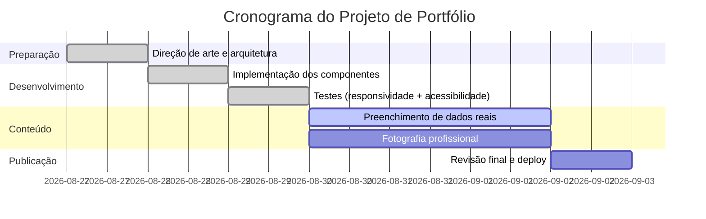

# Maria Eduarda — Portfólio (Contadora)

Site one-page, editorial e minimalista, para a contadora Maria Eduarda. Construído com **Next.js (App Router) + TypeScript + Tailwind CSS v4**, seguindo o prompt mestre de design/desenvolvimento do projeto.

## 1. Direção de arte (resumo)

- **Paleta:** preto (`#0a0a0a`) e branco (`#ffffff`) puros, com cinzas neutros (`#333`, `#8a8a8a`) para hierarquia. Contraste máximo, sem cores corporativas.
- **Tipografia:** `Fraunces` (serifada, editorial) para títulos e citações; `Inter` (sans-serif) para corpo de texto e UI.
- **Layout:** seções alternam fundo branco/cinza-claro/preto para criar ritmo visual (Hero preto → Sobre branco → Especialidades cinza-claro → Trajetória branco → Diferenciais preto → Contato branco).
- **Imagens:** foto principal em preto e branco (`grayscale`), moldura fina, tratamento editorial — sem stock genérico.
- **Interações:** menu fixo discreto que aparece após o scroll inicial; revelação suave (`fade + translateY`) dos blocos de conteúdo via `IntersectionObserver`; `prefers-reduced-motion` respeitado.

## 2. Estrutura de arquivos

```
MariaPortfolio/
├── public/
│   ├── images/
│   │   └── maria-hero.svg      # placeholder — substituir pela foto real
│   └── fallback.html           # fallback estático (HTML/CSS puro, sem JS)
├── src/
│   ├── app/
│   │   ├── layout.tsx          # fontes, <html lang="pt-BR">, metadata/SEO
│   │   ├── page.tsx            # composição da página (uma rota só)
│   │   └── globals.css         # tokens de cor, tipografia, animação
│   ├── components/
│   │   ├── Nav.tsx
│   │   ├── Hero.tsx
│   │   ├── About.tsx
│   │   ├── Specialties.tsx
│   │   ├── Experience.tsx
│   │   ├── Differentiators.tsx
│   │   ├── Contact.tsx
│   │   ├── Footer.tsx
│   │   └── Reveal.tsx           # wrapper de animação de entrada
│   └── content/
│       └── site.ts              # todo o conteúdo textual (placeholders)
├── next.config.ts
├── package.json
└── README.md
```

## 3. Componentes e props

| Componente | Fonte de dados | Descrição |
|---|---|---|
| `Nav` | `links` (interno) | Menu fixo com âncoras; aparece após 60% da altura da viewport. |
| `Hero` | `hero` (`content/site.ts`) | Nome, cargo, chamada e foto. |
| `About` | `about` | Bloco "Quem sou", parágrafos + ano de início. |
| `Specialties` | `specialties[]` | Grade 2 colunas de áreas de atuação (`title`, `description`). |
| `Experience` | `experience[]` | Linha do tempo (`year`, `title`, `place`). |
| `Differentiators` | `differentiators[]` | Bloco preto com números/diferenciais (`value`, `label`). |
| `Contact` | `contact` | E-mail, WhatsApp e formulário (envia via `mailto:`). |
| `Footer` | `hero` | Direitos autorais + cargo. |
| `Reveal` | `children`, `delay` | Wrapper de fade-in ao entrar na viewport. |

Todo o conteúdo editável está centralizado em **`src/content/site.ts`** — não é necessário mexer nos componentes para atualizar textos.

## 4. Dados pendentes (placeholders)

Nenhum dado foi inventado. Antes de publicar, preencha em `src/content/site.ts`:

- [ ] `hero.headline` — chamada curta de efeito.
- [ ] `hero.photo` — substituir `/public/images/maria-hero.svg` por uma fotografia real em preto e branco (`maria-hero.jpg`, atualizar o caminho).
- [ ] `about.paragraphs` — bio real, em primeira pessoa, sem clichês genéricos.
- [ ] `about.yearsActive` — ano de início de atuação.
- [ ] `specialties[]` — 4 áreas reais de atuação contábil.
- [ ] `experience[]` — formação, certificações e marcos reais, com datas.
- [ ] `differentiators[]` — números reais (anos de experiência, registro no CRC, etc.). Remover o bloco caso não haja dado concreto.
- [ ] `contact.email` e `contact.whatsapp` — dados de contato reais.

O mesmo conjunto de placeholders existe em `public/fallback.html` e deve ser atualizado em paralelo.

## 5. Rodando o projeto

```bash
npm install
npm run dev      # desenvolvimento (http://localhost:3000)
npm run build    # build de produção
npm run start    # servir o build de produção
npm run lint     # eslint
```

O fallback estático pode ser aberto diretamente (`public/fallback.html`) ou acessado em `/fallback.html` quando o servidor Next estiver rodando.

## 6. Acessibilidade e performance

- Contraste preto/branco ≈ 21:1 (WCAG AAA para texto).
- HTML semântico (`<header>` implícito via `<section>`, `<main>`, `<nav>`, `<footer>`, `<ol>` na trajetória).
- Foco visível (`:focus-visible`) e navegação por teclado funcional em todos os links/botões.
- `prefers-reduced-motion` desativa transições e scroll suave.
- Fontes carregadas via `next/font` (self-hosted, sem layout shift, sem chamada de terceiros em runtime).
- Imagem do hero com `priority` + `sizes` adequado; demais seções são texto/CSS, sem custo extra de rede.
- Build estático (`○ (Static)`) confirmado via `npm run build`.

## 7. Comparativo de tecnologia

| Item | **Next.js + Tailwind** (escolhido) | React + Vite + Tailwind |
|---|---|---|
| Tipo | Framework full-stack (SSR/SSG, roteamento automático) | SPA build tool, roteamento manual |
| Vantagens | SSG nativo (bom SEO), otimização de imagem/fonte integrada, convenções claras (`app/`) | Início de projeto leve, HMR instantâneo, bundle mínimo |
| Desvantagens | Mais ferramentas embutidas para aprender | SEO/SSR manuais; menos convenções |
| Esforço de implementação | Scaffold + Tailwind já integrados; `next/image`, `next/font` prontos | Exigiria configurar Vite, Tailwind, meta tags e otimização de imagem manualmente |
| Indicado para | Portfólios com SEO e conteúdo majoritariamente estático (este projeto) | SPAs simples onde o tempo de setup é o fator crítico |

Para este portfólio — uma página estática, com foco em SEO e carregamento rápido — **Next.js + Tailwind** foi a escolha implementada.

## 8. Cronograma (referência)



## 9. Status de aceitação

- [x] Todas as seções da arquitetura definida estão implementadas.
- [x] Paleta, tipografia e ritmo visual seguem a direção de arte definida.
- [x] Nenhum conteúdo fictício — apenas placeholders explícitos.
- [x] Build de produção sem erros (`npm run build`) e lint limpo (`npm run lint`).
- [x] Testado em desktop (1440px) e mobile (390px) via Chromium/Playwright — menu fixo legível sobre fundos claros e escuros, âncoras não ficam cobertas pelo menu, sem overflow horizontal.
- [ ] Preenchimento de dados reais e fotografia (pendente do cliente — ver seção 4).
